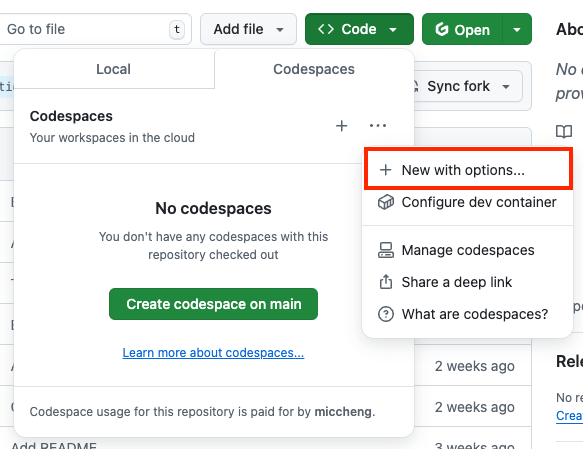
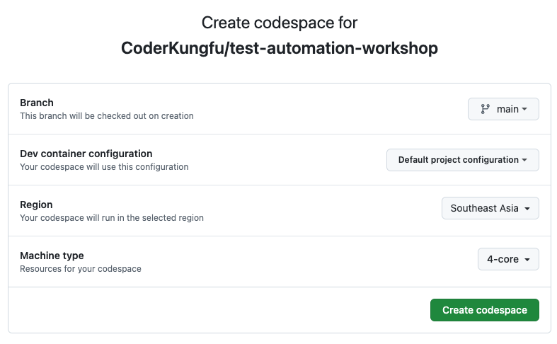
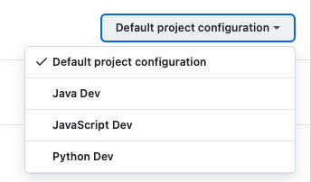
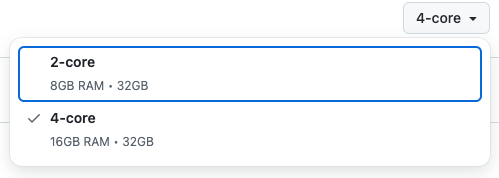

# Exercise 2: Start a Codespace

> **WARNING**: Please follow through the instructions step by step very **carefully** and not press buttons that are not mentioned inside this doc.

1. In your forked repository page, click on **"Code"**, click on the ellipsis (3 dots) button and select the "..." then select **"New with Options"**.

   

2. You will see a form that lets you create your [Codespace](https://docs.github.com/en/codespaces).

   

3. In the "Dev container configuration", select the configuration for your preferred programming language. You will be using this programming language for the To Do List backend and test codes.

   

4. Next, change **Machine Type** to **"4-core"**.

   

5. Click on **"Create codespace"**.

6. Your Codespace will take a few minutes to be setup. It will open a new browser tab.

   

7. Your Codespace is ready to be used.

   

8. Make Port `3000` a public port

   Select the **"Exposed Ports"** tab in the bottom panel:

   

   Right click on row for port `3000`, click on **"Port Visibility"** and change it to **"Public"**.

   

[Next Exercise](./exercise3.md)
