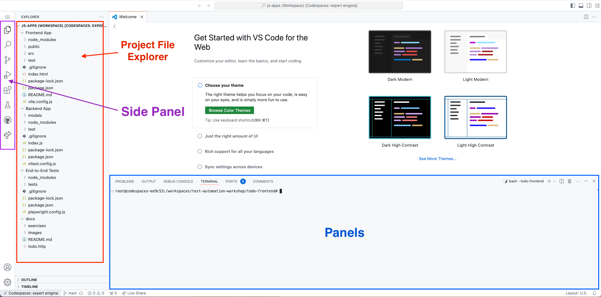

# Exercise 4: Intro to your IDE (Integrated Development Environment) - Visual Studio Code (VSCode)

## Side Bar

### Side Bar items for JS Dev:

- Explorer
- Search / Replace
- Source Control
- Run & Debug
- Extensions
- Testing
- GitHub Pull Request
- Live Share

## Terminal Panel

When you click on **"+"** to create a new Terminal, you can choose to start it in a project workspace.

You can switch between Terminal sessions by selecting the process name at the panel on the right.

### Commonly used Terminal commands

Use these to navigate around the file system in the Devcontainer.

Command | Task | Examples
:------ | :--- | :-------
`cd <folder_name>` | Change directory / navigate to a different directory. | `cd src`
`cd ..` | Navigate the parent directory (one level up). | `cd ../test`
`ls` | List the files and directories in the current folder | `ls`
`ls -al` | Different formatting of the listing | `ls -al`
`ls -al <folder_name>` | List the files in a different folder without navigating to it.  | `ls -al assets`

## Explorer

### Things to note:

- To open a file, double click on the file name.
- To preview a file without opening it, single click on the file name.
- Remember to save the file after making changes to it.

[Next Exercise](./exercise5.md)