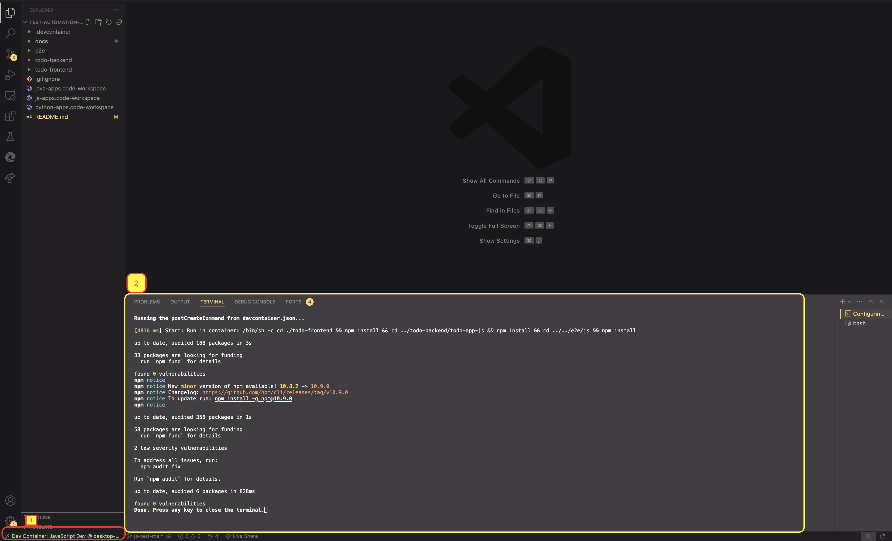

# Dev Container Setup

## Pre Requisites

On your local machine, please ensure that you have the following:

1. VS code IDE
2. [Dev Container extension](https://marketplace.visualstudio.com/items?itemName=ms-vscode-remote.remote-containers) on your VScode IDE.
3. Docker Desktop. You can also use Colima or Rancher Desktop on Windows as alternatives since Docker Desktop does not give free for enterprise version.

## Instructions

1. To get the Dev Containers up and running, press the following keyboard shortcut while being in the VS Code window to open the command palette.

- For Mac, press command + shift + P

- For Windows, press ctrl + shift + P

2. Once the palette is opened, type "dev containers" and then click on "Dev Containers: Rebuild and Reopen in Container" and then follow up options like "Java Dev .devcontainer/java-dev/devcontainer.json" etc. will be displayed. Choose any option that you would like to work on. ie. If you want to work on Javascript, click on the "JavaScript Dev .devcontainer/js-dev/devcontainer.json" vice-versa.

   If you are unsure, follow 

3. The vscode window will reload and spin up to open the container. For example, if you chose the js project, vscode will reload with a new window like this.
   
   You should see the following according to the screenshot labels:
   1. "Dev Container: JavaScript Dev @ desktop-"
   2. The terminal that is loaded along with opening the new container.

You should be able to see something like this on your vscode terminal in your new workspace if you open a terminal on vscode.

4. You can then develop on vscode and save your work as usual but do remember to commit your work for each exercise.
